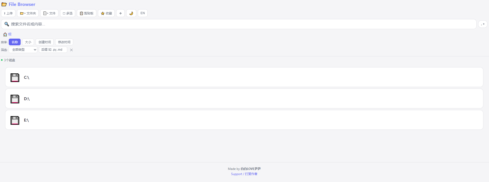
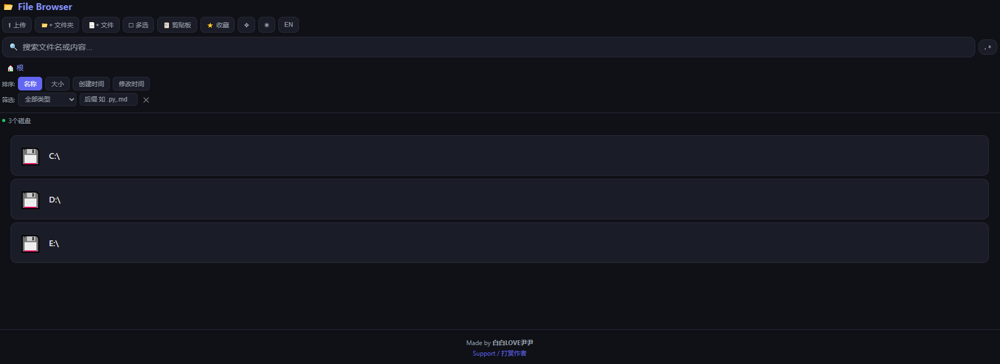
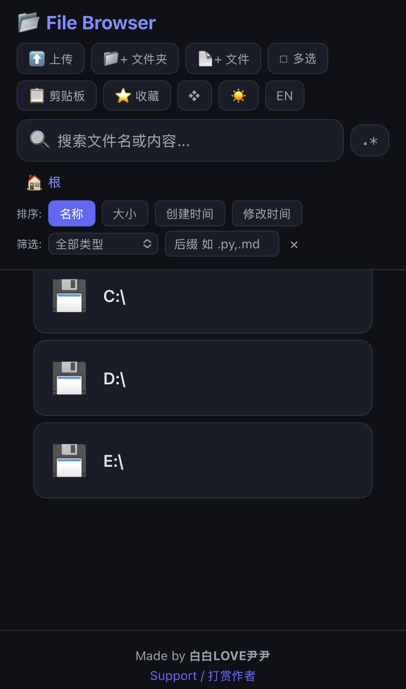
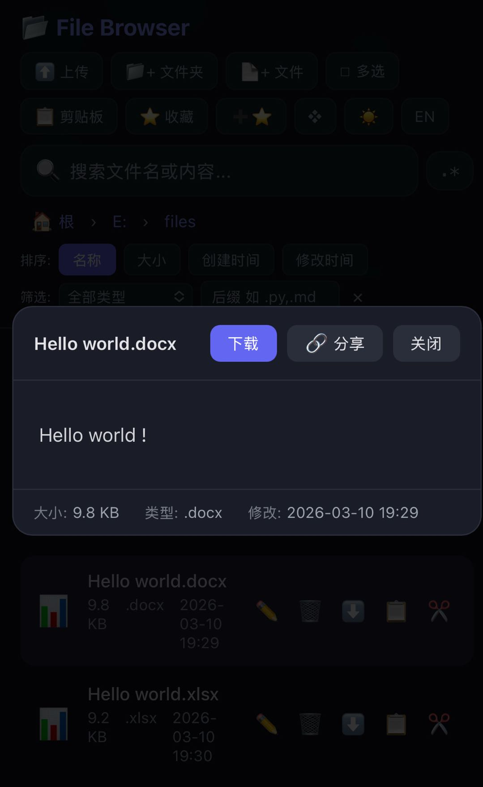

**中文** | [English](README_EN.md)

# LAN File Browser

[](LICENSE)
[](https://www.python.org/downloads/)
[](https://github.com/bbyybb/lan-file-browser/releases)
[](https://github.com/bbyybb/lan-file-browser/stargazers)

局域网文件浏览器 — 一条命令启动，手机即可浏览电脑文件。

支持文件预览、编辑、上传下载、搜索、复制移动、ZIP 解压、临时分享链接、亮暗主题切换、中英双语，完全跨平台。

**Author:** 白白LOVE尹尹 | **License:** MIT

<!-- 程序界面截图 / Screenshots -->
<p align="center">
  &nbsp;
  &nbsp;
  
</p>
<p align="center">
  &nbsp;
  &nbsp;
  
</p>
<p align="center">
  &nbsp;
  
</p>

---

## 快速开始

> 完全不懂编程？没装过 Python？请看 [零基础保姆级教程](docs/BEGINNER.md)

### 方式一：下载可执行文件（推荐，无需安装任何东西）

> ⚠️ **安全提示**：请只从本项目 **[官方 GitHub Releases](https://github.com/bbyybb/lan-file-browser/releases)** 下载，不要使用来源不明的第三方版本。

从 [Releases](https://github.com/bbyybb/lan-file-browser/releases) 页面下载对应平台的文件：
- **Windows**：下载 `FileBrowser.exe`，双击运行
- **macOS Intel**：下载 `FileBrowser-macOS-Intel`
- **macOS Apple M 系列**：下载 `FileBrowser-macOS-AppleSilicon`
- **Linux x86_64**：下载 `FileBrowser-Linux`

macOS / Linux 使用方法（3 步）：
1. 打开「终端」（macOS: 启动台 → 其他 → 终端；Linux: Ctrl+Alt+T）
2. 进入下载目录：`cd ~/Downloads`
3. 添加执行权限并运行：`chmod +x FileBrowser* && ./FileBrowser*`

**验证文件完整性（可选）：** 每次发布会在 Releases 页面附上 SHA256 校验值，可自行核对：
```bash
# Windows（PowerShell）
Get-FileHash FileBrowser.exe -Algorithm SHA256

# macOS / Linux
shasum -a 256 FileBrowser*
```

### 方式二：Python 运行（适合开发者）

**30 秒上手，只需 3 步：**

```bash
# 1. 安装依赖（仅需一次）
pip install flask

# 2. 启动服务
python file_browser.py

# 3. 按提示配置（直接回车使用默认值），然后手机扫码访问
```

> macOS / Linux 请使用 `pip3` 和 `python3`。

启动后会进入交互式引导，按提示操作即可：

```
==================================================
  LAN File Browser - 启动配置
  直接按回车使用 [默认值]
==================================================

  端口 [25600]:
  密码模式:
    1. 自动生成随机密码（默认）
    2. 自定义固定密码
    3. 不设密码
    4. 多用户多密码（不同用户不同权限）
  请选择 [1]:
  访问范围:
    1. 不限制，可访问所有文件（默认）
    2. 只允许访问指定目录
  请选择 [1]:
  阻止系统睡眠（服务运行期间防止电脑休眠）:
    1. 是，阻止睡眠（默认）
    2. 否，允许正常睡眠
  请选择 [1]:
```

**跳过引导，直接启动：**

```bash
# 使用命令行参数时自动跳过引导
python file_browser.py --roots D:/shared E:/docs

# 或用 -y 显式跳过（全部使用默认值）
python file_browser.py -y

# 查看所有参数
python file_browser.py --help
```

启动成功后终端输出如下：

```
======================================================
  [File Browser v2.1] started
======================================================
  Local:    http://localhost:25600
  Phone:    http://192.168.1.100:25600
  Password: CvW$MwG*kuV5Yy*b12ZHohEX$WLZDd&Z   <-- 每次随机生成
======================================================
```

---

## 功能总览

### 文件浏览与管理

| 功能 | 说明 |
|------|------|
| 磁盘浏览 | Windows 自动识别 C:\、D:\ 等盘符；macOS/Linux 从 `/` 开始 |
| 面包屑导航 | 顶部路径条，点击任意层级可快速跳转 |
| 排序与筛选 | 按名称/大小/创建时间/修改时间排序，按文件类型或扩展名筛选 |
| 目录收藏 | 将常用目录添加到收藏夹，一键直达 |
| 记住位置 | 自动回到上次浏览的目录（每台设备独立记忆） |
| **文件复制** | 可视化目录选择器选择目标，同名自动加 `_copy` 后缀 |
| **文件移动** | 可视化目录选择器选择目标，支持浏览导航 |
| 上传文件 | 点击上传按钮或**直接拖拽文件到页面** |
| 新建文件/文件夹 | 在当前目录创建，支持输入初始内容 |
| 重命名 / 删除 | 重命名支持名称冲突检测；删除非空文件夹需二次确认后**递归删除** |

### 文件预览与编辑

| 功能 | 说明 |
|------|------|
| 图片 / 视频 / 音频 | 内置播放器，支持 jpg/png/gif/mp4/mp3 等主流格式 |
| **视频字幕** | 自动检测同目录下同名 .vtt/.srt/.ass 字幕文件并加载 |
| PDF | 浏览器内嵌阅读器（手机端自动适配） |
| Markdown | marked.js 渲染（GFM 语法 + Mermaid 图表），支持文档内链接跳转 |
| **Office 预览** | docx 渲染为 HTML，xlsx/xls 渲染为表格（mammoth.js + SheetJS） |
| 代码/文本 | 40+ 种语言语法高亮 |
| **ZIP 预览** | 点击 `.zip` 文件直接查看内容列表，一键**在线解压** |
| 在线编辑 | 文本/代码/Markdown 文件直接编辑保存，支持 Tab 缩进、Ctrl+S、自动 `.bak` 备份 |

### 下载与分享

| 功能 | 说明 |
|------|------|
| 单文件下载 | 列表中或预览弹窗中一键下载 |
| 批量打包下载 | 多选文件打包 zip 下载 |
| **批量操作** | 多选后批量删除、批量移动、批量复制，支持一键全选 |
| **文件夹整体下载** | 点击文件夹的下载按钮，递归打包为 zip |
| **临时分享链接** | 预览弹窗中点击"分享"，生成 1 小时有效的公开下载链接，对方无需登录 |
| 共享剪贴板 | 手机和电脑之间快速互传文本 |

### 搜索

| 功能 | 说明 |
|------|------|
| 文件名搜索 | 输入关键词即时搜索（500ms 防抖，递归 6 层，最多 100 条） |
| 文件内容搜索 | 搜索文本文件内部的文字，返回行号和匹配内容 |
| **正则搜索** | 搜索框旁点击 `.*` 按钮启用正则表达式模式 |

### 界面与体验

| 功能 | 说明 |
|------|------|
| **亮色 / 暗色主题** | 工具栏点击切换，偏好自动保存 |
| **网格 / 列表视图** | 网格模式下图片自动显示缩略图 |
| **中 / 英语言切换** | 工具栏一键切换界面语言 |
| 移动端适配 | 触屏优化，手指操作友好 |
| 密码保护 | 每次启动自动生成 32 位高强度密码，支持自定义或禁用 |
| **多用户多密码** | 管理员密码（完全权限）+ 只读密码（仅浏览和下载），适合教师/团队场景 |
| **目录白名单** | 配置 `ALLOWED_ROOTS` 限制只能访问指定目录，未列入的路径全部禁止 |
| 二维码 | 登录页自动显示访问地址二维码，手机扫码即开 |
| **阻止睡眠** | 服务运行期间自动阻止电脑睡眠，退出后恢复（跨平台） |
| 访问日志 | 所有操作自动记录到 `access.log`，同时输出到终端 |

---

## 环境要求

| 项目 | 要求 |
|------|------|
| Python | 3.8+ |
| 依赖 | Flask（`pip install flask`，唯一依赖） |
| 网络 | 电脑和手机在同一局域网 |
| 浏览器 | Chrome（推荐）、Safari、Firefox、Edge |
| 系统 | Windows 10/11、macOS 10.15+、Linux |

---

## 停止服务

| 方式 | 命令 |
|------|------|
| **推荐** | 在启动终端按 `Ctrl+C` |
| Windows 脚本 | 双击 `stop_server.bat`（自定义端口: `stop_server.bat 8080`） |
| macOS/Linux 脚本 | `bash stop_server.sh`（自定义端口: `bash stop_server.sh 8080`） |
| 手动 (Windows) | `netstat -ano \| findstr :25600` 找 PID → `taskkill /PID xxx /F` |
| 手动 (macOS) | `lsof -ti :25600 \| xargs kill -9` |

---

## 配置说明

有两种方式配置参数，**命令行参数优先于文件配置**：

### 方式一：命令行参数（临时生效，不改文件）

| 参数 | 说明 | 示例 |
|------|------|------|
| `--port` | 服务端口 | `--port 8080` |
| `--password` | 指定固定密码 | `--password my123` |
| `--no-password` | 禁用密码保护 | `--no-password` |
| `--roots` | 目录白名单（可多个） | `--roots D:/shared E:/docs` |
| `--read-only` | 只读模式，禁止修改操作 | `--read-only` |
| `--no-sleep` | 不阻止系统睡眠 | `--no-sleep` |
| `--allow-sleep` | 同 `--no-sleep` | `--allow-sleep` |
| `--lang` | 界面语言（终端 + 浏览器） | `--lang en` |
| `-y` | 跳过交互式引导 | `-y` |

> 传了命令行参数时自动跳过交互式引导；不传参数则进入引导。

### 方式二：修改文件（永久生效）

所有配置项在 `file_browser.py` 文件顶部，修改后重启生效：

```python
PORT = 25600                    # 端口（被占用时可改为 9000 等）
PASSWORD = None                 # None=每次随机, ""=禁用密码, "xxx"=固定密码
ALLOWED_ROOTS = []              # []=不限制, ["D:/shared","E:/docs"]=只允许这些目录
READ_ONLY = False               # True=只读模式, False=完全权限
USERS = {}                      # 多用户模式，见下方说明
PREVENT_SLEEP = True            # True=阻止系统睡眠, False=允许正常睡眠

LOGIN_RATE_WINDOW = 60          # 登录速率限制窗口（秒）
LOGIN_RATE_MAX    = 10          # 窗口内单 IP 最多尝试次数

SEARCH_MAX_RESULTS = 100        # 文件名搜索最大结果数
SEARCH_MAX_DEPTH = 6            # 搜索最大递归深度
CONTENT_SEARCH_MAX_SIZE = 512 * 1024   # 内容搜索单文件上限 (512KB)
CONTENT_SEARCH_MAX_FILES = 500         # 内容搜索最大扫描文件数
CONTENT_SEARCH_MAX_RESULTS = 50        # 内容搜索最大结果数

# 上传文件默认无大小限制，如需限制可取消注释下一行
# app.config['MAX_CONTENT_LENGTH'] = 100 * 1024 * 1024  # 示例: 限制为 100MB
```

---

## 安全说明

### 风险评估

| 场景 | 风险 | 说明 |
|------|------|------|
| 家庭 WiFi | 低 | 仅同网段设备可访问，密码保护 |
| 公共 WiFi | 中高 | HTTP 明文传输，可被抓包 |
| 暴露到公网 | **极高** | **强烈不建议**，即使有密码也不安全 |

### 安全机制

- **目录白名单**：配置 `ALLOWED_ROOTS` 后只能访问指定目录及其子内容，其余路径全部拒绝
- 恒定时间密码比对（`hmac.compare_digest`），防止时序攻击
- 登录速率限制（每 IP 60 秒最多 10 次），防止暴力破解
- 登录请求体限制 1KB，防止超大 payload
- 系统关键目录保护（`C:\Windows`、`/usr`、`/etc` 等禁止删除）
- ZIP 解压 Zip Slip 防护（`os.path.realpath` 校验）
- 分享链接自动过期清理

### 最佳实践

1. 用完即关（`Ctrl+C`）
2. 公网访问时务必配置 `ALLOWED_ROOTS` 白名单 + 强密码（详见 [公网访问指南](docs/GUIDE.md#公网访问外网穿透)）
3. 在可信网络下使用
4. 定期查看 `access.log`

---

## 常见问题 (FAQ)

**Q: 手机无法访问？**
确认在同一 WiFi 下，使用终端显示的 IP（不要猜）。Windows 可能需添加防火墙规则：
```powershell
New-NetFirewallRule -DisplayName "File Browser" -Direction Inbound -Protocol TCP -LocalPort 25600 -Action Allow
```

**Q: 忘记密码？** 重启程序即可，每次生成新密码。或设置 `PASSWORD = "你的密码"`。

**Q: 端口被占用？** 修改 `PORT = 9000` 改用其他端口。

**Q: Markdown 渲染失败？** 需要网络访问 `cdn.jsdelivr.net`。离线环境会回退为纯文本。

**Q: 删除的文件能恢复吗？** 不能，不经过回收站，永久删除。

**Q: 支持 macOS 吗？** 完全支持。`python3 file_browser.py` 启动即可。

**Q: 多人同时使用？** 可以，多线程模式，多台设备共用同一密码。

---

## 项目结构

```
lan-file-browser/
├── file_browser.py      # 主程序（后端 + 前端，单文件）
├── stop_server.bat      # 停止脚本 (Windows)
├── stop_server.sh       # 停止脚本 (macOS/Linux)
├── requirements.txt     # 依赖列表
├── LICENSE              # MIT 协议
├── README.md            # 中文文档（快速上手）
├── README_EN.md         # English documentation (Quick Start)
├── docs/
│   ├── GUIDE.md         # 详细功能使用指南
│   ├── GUIDE_EN.md      # Detailed feature guide (English)
│   ├── API.md           # API 接口文档
│   ├── API_EN.md        # API documentation (English)
│   ├── BEGINNER.md      # 零基础安装教程
│   └── BEGINNER_EN.md   # Beginner tutorial (English)
├── bookmarks.json       # [运行后生成] 收藏夹数据
└── access.log           # [运行后生成] 访问日志
```

> 详细的功能使用说明见 [docs/GUIDE.md](docs/GUIDE.md)，API 接口文档见 [docs/API.md](docs/API.md)。

---

## 支持作者 / Support

如果这个项目对你有帮助，欢迎请作者喝杯咖啡 ☕

If this project is helpful to you, feel free to buy the author a coffee ☕

| 微信支付 WeChat Pay | 支付宝 Alipay | Buy Me a Coffee |
|:---:|:---:|:---:|
|  |  | <a href="https://www.buymeacoffee.com/bbyybb"></a> |

[buymeacoffee.com/bbyybb](https://www.buymeacoffee.com/bbyybb) | [GitHub Sponsors](https://github.com/sponsors/bbyybb/)
