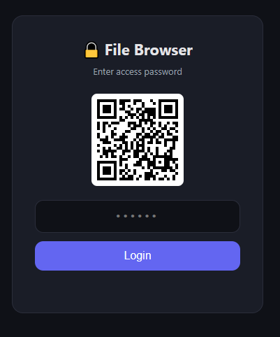
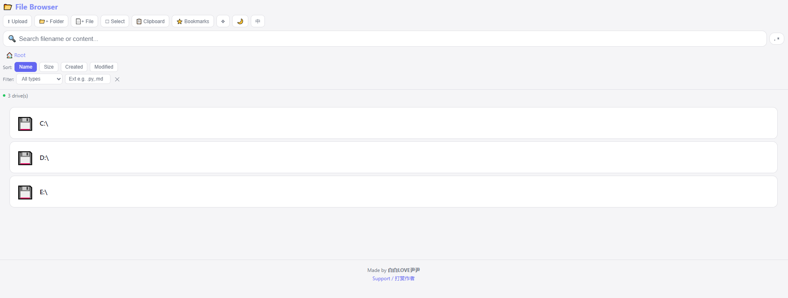
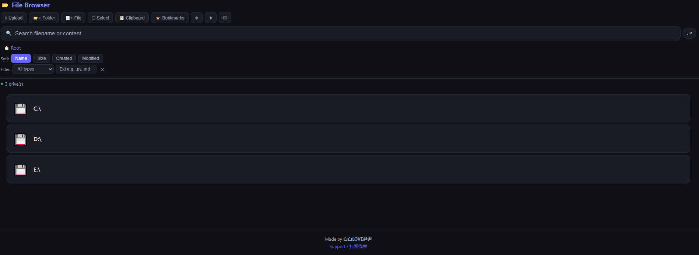
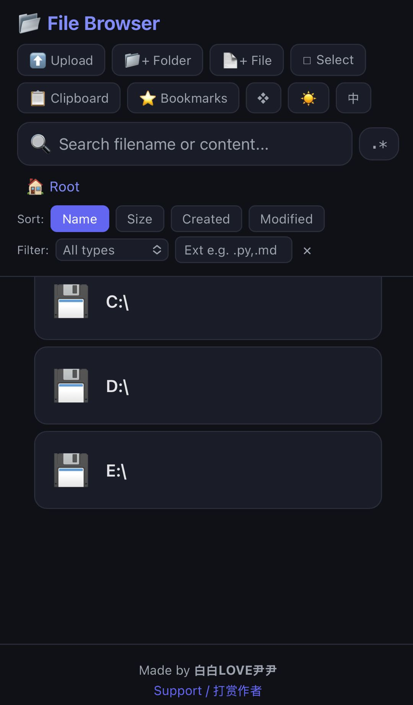
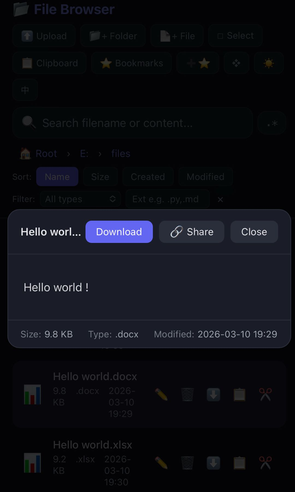

[中文](README.md) | **English**

# LAN File Browser

[](LICENSE)
[](https://www.python.org/downloads/)
[](https://github.com/bbyybb/lan-file-browser/releases)
[](https://github.com/bbyybb/lan-file-browser/stargazers)

LAN File Browser — start with one command, browse your computer files from your phone.

Supports file preview, editing, upload/download, search, copy/move, ZIP extraction, temporary share links, light/dark theme, Chinese/English bilingual, fully cross-platform.

**Author:** 白白LOVE尹尹 | **License:** MIT

<!-- Program Interface Screenshots -->
<p align="center">
  
  
  
</p>
<p align="center">
  
  
</p>

---

## Quick Start

> Complete beginner? Never installed Python? See the [Step-by-Step Beginner Tutorial](docs/BEGINNER_EN.md)

### Option 1: Download Executable (Recommended, no installation needed)

> ⚠️ **Security notice**: Only download from the **[official GitHub Releases](https://github.com/bbyybb/lan-file-browser/releases)**. Do not use third-party redistributions.

Download from the [Releases](https://github.com/bbyybb/lan-file-browser/releases) page:
- **Windows**: Download `FileBrowser.exe`, double-click to run
- **macOS Intel**: Download `FileBrowser-macOS-Intel`
- **macOS Apple Silicon**: Download `FileBrowser-macOS-AppleSilicon`

macOS instructions (3 steps):
1. Open **Terminal** (Launchpad → Other → Terminal, or Spotlight search "Terminal")
2. Navigate to downloads: `cd ~/Downloads`
3. Add execute permission and run: `chmod +x FileBrowser* && ./FileBrowser*`

**Verify file integrity (optional):** Each release includes SHA256 checksums on the Releases page:
```bash
# Windows (PowerShell)
Get-FileHash FileBrowser.exe -Algorithm SHA256

# macOS / Linux
shasum -a 256 FileBrowser*
```

### Option 2: Run with Python (for developers)

**Get started in 30 seconds, just 3 steps:**

```bash
# 1. Install dependency (one time only)
pip install flask

# 2. Start the server
python file_browser.py

# 3. Follow the prompts (press Enter for defaults), then scan the QR code with your phone
```

> On macOS / Linux, use `pip3` and `python3`.

After starting, you'll enter an interactive setup wizard — just follow the prompts:

```
==================================================
  LAN File Browser - Startup Configuration
  Press Enter to use [default values]
==================================================

  Port [25600]:
  Password mode:
    1. Auto-generate random password (default)
    2. Custom fixed password
    3. No password
    4. Multi-user multi-password (different permissions)
  Choose [1]:
  Access scope:
    1. Unrestricted, access all files (default)
    2. Only allow access to specified directories
  Choose [1]:
  Prevent system sleep (keep computer awake while running):
    1. Yes, prevent sleep (default)
    2. No, allow normal sleep
  Choose [1]:
```

**Skip the wizard and start directly:**

```bash
# Using command-line arguments auto-skips the wizard
python file_browser.py --roots D:/shared E:/docs

# Or use -y to explicitly skip (all defaults)
python file_browser.py -y

# View all parameters
python file_browser.py --help
```

After successful startup, the terminal shows:

```
======================================================
  [File Browser v2.1] started
======================================================
  Local:    http://localhost:25600
  Phone:    http://192.168.1.100:25600
  Password: CvW$MwG*kuV5Yy*b12ZHohEX$WLZDd&Z   <-- randomly generated each time
======================================================
```

---

## Feature Overview

### File Browsing & Management

| Feature | Description |
|---------|-------------|
| Disk Browsing | Windows auto-detects C:\, D:\, etc.; macOS/Linux starts from `/` |
| Breadcrumb Navigation | Top path bar, click any level to jump |
| Sort & Filter | Sort by name/size/creation time/modification time, filter by file type or extension |
| Directory Bookmarks | Add frequently used directories to bookmarks for quick access |
| Remember Location | Auto-returns to last browsed directory (per device) |
| **File Copy** | Visual directory picker to choose target, auto-adds `_copy` suffix for duplicates |
| **File Move** | Visual directory picker to choose target, supports browse navigation |
| Upload Files | Click upload button or **drag & drop files onto the page** |
| Create File/Folder | Create in current directory, supports initial content input |
| Rename / Delete | Rename with conflict detection; deleting non-empty folders requires confirmation then **recursive deletion** |

### File Preview & Editing

| Feature | Description |
|---------|-------------|
| Image / Video / Audio | Built-in player, supports jpg/png/gif/mp4/mp3 and other major formats |
| **Video Subtitles** | Auto-detects same-name .vtt/.srt/.ass subtitle files in the same directory |
| PDF | In-browser reader (mobile-adapted) |
| Markdown | marked.js rendering (GFM syntax + Mermaid diagrams), supports in-document link navigation |
| **Office Preview** | docx rendered as HTML, xlsx/xls rendered as tables (mammoth.js + SheetJS) |
| Code/Text | 40+ language syntax highlighting |
| **ZIP Preview** | Click `.zip` files to view contents, one-click **online extraction** |
| Online Editing | Edit and save text/code/Markdown files directly, supports Tab indent, Ctrl+S, auto `.bak` backup |

### Download & Sharing

| Feature | Description |
|---------|-------------|
| Single File Download | One-click download from list or preview modal |
| Batch Zip Download | Select multiple files and download as zip |
| **Batch Operations** | Multi-select for batch delete, move, copy, with select-all support |
| **Folder Download** | Click folder download button, recursively packaged as zip |
| **Temporary Share Links** | Click "Share" in preview modal, generates a 1-hour public download link, no login required |
| Shared Clipboard | Quickly transfer text between phone and computer |

### Search

| Feature | Description |
|---------|-------------|
| Filename Search | Enter keywords for instant search (500ms debounce, 6 levels deep, max 100 results) |
| File Content Search | Search text inside files, returns line numbers and matching content |
| **Regex Search** | Click the `.*` button next to search box to enable regex mode |

### Interface & Experience

| Feature | Description |
|---------|-------------|
| **Light / Dark Theme** | Toggle in toolbar, preference auto-saved |
| **Grid / List View** | Grid mode auto-displays image thumbnails |
| **Chinese / English Toggle** | One-click language switch in toolbar |
| Mobile Optimized | Touch-friendly, optimized for mobile devices |
| Password Protection | Auto-generates 32-char strong password each startup, supports custom or disable |
| **Multi-User Multi-Password** | Admin password (full access) + read-only password (browse and download only), ideal for teachers/teams |
| **Directory Whitelist** | Configure `ALLOWED_ROOTS` to restrict access to specified directories only |
| QR Code | Login page auto-displays access URL QR code for quick phone scanning |
| **Prevent Sleep** | Auto-prevents computer sleep while running, restores on exit (cross-platform) |
| Access Log | All operations auto-logged to `access.log` and printed to terminal |

---

## Requirements

| Item | Requirement |
|------|-------------|
| Python | 3.8+ |
| Dependencies | Flask (`pip install flask`, only dependency) |
| Network | Computer and phone on the same LAN |
| Browser | Chrome (recommended), Safari, Firefox, Edge |
| OS | Windows 10/11, macOS 10.15+, Linux |

---

## Stopping the Server

| Method | Command |
|--------|---------|
| **Recommended** | Press `Ctrl+C` in the startup terminal |
| Windows Script | Double-click `stop_server.bat` (custom port: `stop_server.bat 8080`) |
| macOS/Linux Script | `bash stop_server.sh` (custom port: `bash stop_server.sh 8080`) |
| Manual (Windows) | `netstat -ano \| findstr :25600` to find PID → `taskkill /PID xxx /F` |
| Manual (macOS) | `lsof -ti :25600 \| xargs kill -9` |

---

## Configuration

There are two ways to configure parameters. **Command-line arguments take priority over file configuration**:

### Method 1: Command-Line Arguments (temporary, doesn't modify files)

| Parameter | Description | Example |
|-----------|-------------|---------|
| `--port` | Server port | `--port 8080` |
| `--password` | Set fixed password | `--password my123` |
| `--no-password` | Disable password protection | `--no-password` |
| `--roots` | Directory whitelist (multiple allowed) | `--roots D:/shared E:/docs` |
| `--read-only` | Read-only mode, disables modifications | `--read-only` |
| `--no-sleep` | Don't prevent system sleep | `--no-sleep` |
| `--allow-sleep` | Same as `--no-sleep` | `--allow-sleep` |
| `--lang` | UI language (terminal + browser) | `--lang en` |
| `-y` | Skip interactive wizard | `-y` |

> When command-line arguments are provided, the interactive wizard is auto-skipped; without arguments, the wizard starts.

### Method 2: Modify File (persistent)

All configuration options are at the top of `file_browser.py`, restart to apply:

```python
PORT = 25600                    # Port (change to 9000 etc. if occupied)
PASSWORD = None                 # None=random each time, ""=disable password, "xxx"=fixed password
ALLOWED_ROOTS = []              # []=unrestricted, ["D:/shared","E:/docs"]=only these directories
READ_ONLY = False               # True=read-only mode, False=full access
USERS = {}                      # Multi-user mode, see below
PREVENT_SLEEP = True            # True=prevent system sleep, False=allow normal sleep

LOGIN_RATE_WINDOW = 60          # Login rate limit window (seconds)
LOGIN_RATE_MAX    = 10          # Max attempts per IP within window

SEARCH_MAX_RESULTS = 100        # Max filename search results
SEARCH_MAX_DEPTH = 6            # Max search recursion depth
CONTENT_SEARCH_MAX_SIZE = 512 * 1024   # Content search file size limit (512KB)
CONTENT_SEARCH_MAX_FILES = 500         # Content search max files scanned
CONTENT_SEARCH_MAX_RESULTS = 50        # Content search max results

# No upload size limit by default. Uncomment next line to set a limit:
# app.config['MAX_CONTENT_LENGTH'] = 100 * 1024 * 1024  # Example: 100MB limit
```

---

## Security

### Risk Assessment

| Scenario | Risk | Notes |
|----------|------|-------|
| Home WiFi | Low | Only same-subnet devices can access, password protected |
| Public WiFi | Medium-High | HTTP plaintext transmission, can be sniffed |
| Exposed to Internet | **Very High** | **Strongly discouraged**, even with password it's not secure |

### Security Mechanisms

- **Directory whitelist**: After configuring `ALLOWED_ROOTS`, only specified directories and their contents are accessible; all other paths are denied
- Constant-time password comparison (`hmac.compare_digest`), prevents timing attacks
- Login rate limiting (10 attempts per IP per 60 seconds), prevents brute force
- Login request body limited to 1KB, prevents oversized payloads
- System critical directory protection (`C:\Windows`, `/usr`, `/etc`, etc. cannot be deleted)
- ZIP extraction Zip Slip protection (`os.path.realpath` validation)
- Share links auto-expire and clean up

### Best Practices

1. Stop when done (`Ctrl+C`)
2. For public access, always configure `ALLOWED_ROOTS` whitelist + strong password (see [Public Access Guide](docs/GUIDE_EN.md#public-access-tunneling))
3. Use on trusted networks
4. Regularly check `access.log`

---

## FAQ

**Q: Phone can't access?**
Confirm you're on the same WiFi, use the IP shown in terminal (don't guess). Windows may need a firewall rule:
```powershell
New-NetFirewallRule -DisplayName "File Browser" -Direction Inbound -Protocol TCP -LocalPort 25600 -Action Allow
```

**Q: Forgot password?** Restart the program, a new password is generated each time. Or set `PASSWORD = "your_password"`.

**Q: Port is occupied?** Change `PORT = 9000` to use a different port.

**Q: Markdown rendering failed?** Requires network access to `cdn.jsdelivr.net`. Falls back to plain text in offline environments.

**Q: Can deleted files be recovered?** No, they bypass the recycle bin and are permanently deleted.

**Q: macOS support?** Fully supported. Start with `python3 file_browser.py`.

**Q: Multiple users at once?** Yes, multi-threaded mode, multiple devices share the same password.

---

## Project Structure

```
lan-file-browser/
├── file_browser.py      # Main program (backend + frontend, single file)
├── stop_server.bat      # Stop script (Windows)
├── stop_server.sh       # Stop script (macOS/Linux)
├── requirements.txt     # Dependency list
├── LICENSE              # MIT License
├── README.md            # Chinese documentation (quick start)
├── README_EN.md         # English documentation (this file)
├── docs/
│   ├── GUIDE.md         # Detailed feature guide (Chinese)
│   ├── GUIDE_EN.md      # Detailed feature guide (English)
│   ├── API.md           # API documentation (Chinese)
│   ├── API_EN.md        # API documentation (English)
│   ├── BEGINNER.md      # Beginner tutorial (Chinese)
│   └── BEGINNER_EN.md   # Beginner tutorial (English)
├── bookmarks.json       # [Generated at runtime] Bookmark data
└── access.log           # [Generated at runtime] Access log
```

> For detailed feature guide see [docs/GUIDE_EN.md](docs/GUIDE_EN.md), API documentation see [docs/API_EN.md](docs/API_EN.md).

---

## Support the Author

If this project is helpful to you, feel free to buy the author a coffee ☕

如果这个项目对你有帮助，欢迎请作者喝杯咖啡 ☕

### WeChat & Alipay

| WeChat Pay | Alipay |
|:---:|:---:|
|  |  |

### International

<a href="https://www.buymeacoffee.com/bbyybb"></a>

**☕ Buy Me a Coffee**

- 💖 **GitHub Sponsors**: https://github.com/sponsors/bbyybb/
