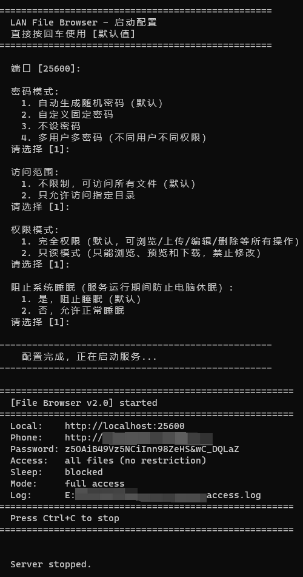

**中文** | [English](BEGINNER_EN.md)

# 零基础安装使用教程

> 本教程面向完全没有编程经验的用户，手把手教你从零开始搭建和使用。
>
> 返回 [README](../README.md)

> **快捷方式**：如果不想安装 Python，可以直接从 [Releases](https://github.com/bbyybb/lan-file-browser/releases) 下载可执行文件，跳过下面的第一步到第三步。
> - **Windows**：下载 `FileBrowser.exe`，双击运行
> - **macOS**：下载 `lan-file-browser-macOS-*`，双击即可运行（系统会自动打开终端）
>>   首次运行若提示"无法验证开发者"，请前往「系统设置 > 隐私与安全性」点击「仍要打开」
> - **Linux**：下载 `lan-file-browser-Linux`，双击或在终端执行 `cd ~/Downloads && ./lan-file-browser*`

---

## 第一步：安装 Python（只需一次）

Python 是运行本程序的环境，类似于运行 Word 需要先装 Office。

### Windows 用户

1. 打开浏览器，访问 Python 官网下载页面：
   https://www.python.org/downloads/

2. 点击黄色的 **"Download Python 3.x.x"** 按钮，下载安装包

3. 双击运行下载好的安装包（如 `python-3.x.x-amd64.exe`）

4. **最关键的一步**：在安装界面底部，**一定要勾选 "Add Python to PATH"**
   ```
   ☑ Add Python 3.x to PATH    ← 必须勾选！！！
   ```
   > 如果忘记勾选，后面的命令会提示"找不到 python"

5. 点击 **"Install Now"** 开始安装

6. 等待安装完成，点击 **"Close"**

### macOS 用户

1. 打开 **"终端"** 应用（在"启动台" → "其他" → "终端"，或 Spotlight 搜索"终端"）

2. 输入以下命令查看是否已自带 Python：
   ```
   python3 --version
   ```

3. 如果显示 `Python 3.x.x` 说明已安装，跳到第二步

4. 如果提示未找到，访问 https://www.python.org/downloads/ 下载 macOS 版安装

### 验证 Python 安装成功

安装完成后，打开终端（见下方"如何打开终端"），输入：

```
python --version
```

看到类似 `Python 3.11.5` 的输出就表示安装成功。

> macOS/Linux 用户请用 `python3 --version`

---

## 如何打开终端（命令行）

终端就是一个可以输入命令的黑色窗口，不用害怕，只需要复制粘贴命令就行。

### Windows

有三种方式（任选一种）：

**方式 A（最简单）：**
1. 按键盘上的 `Win` 键（窗口图标键）
2. 直接输入 `cmd`
3. 点击出现的 **"命令提示符"**

**方式 B：**
1. 在文件资源管理器中打开 `file_browser.py` 所在的文件夹
2. 在地址栏中输入 `cmd` 然后按回车

**方式 C：**
1. 右键点击桌面空白处或文件夹空白处
2. 选择 **"在终端中打开"**（Windows 11）或 **"在此处打开命令窗口"**（Windows 10）

### macOS

1. 按 `Command + 空格` 打开 Spotlight
2. 输入 `终端`（或 `Terminal`）
3. 按回车打开

---

## 第二步：下载本程序

1. 打开 https://github.com/bbyybb/lan-file-browser
2. 点击绿色的 **"Code"** 按钮
3. 点击 **"Download ZIP"**
4. 解压下载的 ZIP 文件到任意位置（如桌面）

> 请下载完整的 ZIP 包，不要只下载单个文件，否则程序无法正常运行。

---

## 第三步：安装依赖（只需一次）

打开终端，输入以下命令：

```
pip install flask
```

> macOS/Linux 用户请用 `pip3 install flask`

看到类似 `Successfully installed flask-x.x.x` 的输出就表示安装成功。

**常见问题：**
- 如果提示 `'pip' 不是内部或外部命令`，说明 Python 安装时没勾选 "Add to PATH"，需要重新安装 Python 并勾选
- 如果下载很慢，可以使用国内镜像：
  ```
  pip install flask -i https://pypi.tuna.tsinghua.edu.cn/simple
  ```

---

## 第四步：启动程序

### 4.1 进入程序所在目录

假设你把程序解压到了桌面的 `lan-file-browser` 文件夹：

**Windows：**
```
cd Desktop\lan-file-browser
```

**macOS：**
```
cd ~/Desktop/lan-file-browser
```

> 或者用前面提到的"在文件夹中打开终端"的方式，就不需要 cd 了

### 4.2 运行程序

```
python file_browser.py
```

> macOS/Linux 用户请用 `python3 file_browser.py`

### 4.3 按提示配置

程序会显示交互式引导，**每个问题直接按回车就行**（使用默认值）：

```
==================================================
  LAN File Browser - 启动配置
  直接按回车使用 [默认值]
==================================================

  端口 [25600]:                          ← 直接按回车
  密码模式:
    1. 自动生成随机密码（默认）
    2. 自定义固定密码
    3. 不设密码
    4. 多用户多密码（不同用户不同权限）
  请选择 [1]:                            ← 直接按回车
  ...
```

> **教师推荐配置：** 如果是教室里给学生分享课件，选密码模式 `4`（多用户），然后选 `1`（自动生成），系统会自动生成一个管理员密码和一个只读密码。

### 4.4 启动成功

看到以下界面说明启动成功：

<!-- 终端启动截图 -->


```
======================================================
  [File Browser v1.0.0] started
======================================================
  Local:    http://localhost:25600
  Phone:    http://192.168.1.100:25600    ← 手机要打开的地址
  Password: CvW$MwG*kuV5Yy*b12ZHohEX     ← 登录密码
======================================================
  Press Ctrl+C to stop
======================================================
```

**记住两个关键信息：**
- `Phone` 行后面的地址 → 在手机浏览器中打开（或分享给他人）
- `Password` 行后面的密码 → 登录时输入

---

## 第五步：手机端使用

### 5.1 连接同一个 WiFi

确保手机和电脑连接在 **同一个 WiFi** 下（同一个路由器）。

> 例如：家里的电脑和手机都连家里的 WiFi；教室里都连学校的 WiFi

### 5.2 打开浏览器

在手机上打开任意浏览器（Safari、Chrome 等），在地址栏输入终端显示的 `Phone` 地址，例如：

```
http://192.168.1.100:25600
```

> 注意：是 `http://` 不是 `https://`，要输完整的地址包括端口号

### 5.3 扫码更方便

如果觉得输地址麻烦，可以用手机扫描登录页面上的二维码（页面中央会自动显示）。

### 5.4 输入密码

在登录页面输入终端显示的密码，点击"登录"。

### 5.5 开始使用

登录后就能看到电脑上的文件了：
- **点击文件夹** → 进入查看
- **点击文件** → 预览（图片、视频、PDF、Word、Excel 等）
- **点击 ⬇ 按钮** → 下载文件到手机
- **顶部搜索框** → 搜索文件

---

## 第六步：停止程序

用完后，在终端窗口按 `Ctrl + C`（同时按住 Ctrl 键和 C 键），程序会显示：

```
  Server stopped.
```

关闭终端窗口即可。

---

## 常用场景示例

### 场景 1：只分享指定文件夹（只读模式）

只把某个文件夹共享出去，别人只能看和下载，不能改：

```
python file_browser.py --roots D:/共享资料 --read-only --no-password
```

> macOS 示例：`python3 file_browser.py --roots /Users/你的用户名/共享资料 --read-only --no-password`

效果：
- 只能看到"共享资料"文件夹的内容
- 只能浏览和下载，不能修改
- 无需密码，扫码直接用

### 场景 2：不同密码不同权限

启动时密码模式选 `4`（多用户） → 选 `1`（自动生成），系统会显示两个密码：

```
  Users:    2 user(s):
            - admin  (管理员): xKj9Tm2P...    ← 你自己用的密码（完全权限）
            - reader (只读):   Qs7nWj4R...    ← 分享给别人的密码（只读）
```

- 你用 `admin` 密码登录 → 可以上传、编辑、删除
- 别人用 `reader` 密码登录 → 只能浏览和下载

### 场景 3：生成临时下载链接发给朋友

1. 打开一个文件的预览
2. 点击顶部的 **"🔗 分享"** 按钮
3. 复制生成的链接，发给朋友
4. 朋友点击链接直接下载，不需要登录（链接有效期可选：5分钟 / 30分钟 / 1小时 / 6小时 / 12小时 / 24小时，默认1小时，过期后自动失效）

---

## 常见问题

### 手机打不开地址？

1. 确认手机和电脑在同一个 WiFi
2. 确认输入的是 `Phone` 行的地址，不是 `Local` 行的
3. 确认地址输完整了，包括 `:25600` 端口号
4. Windows 可能需要允许防火墙（首次运行时系统会弹窗询问，点"允许"）

### 提示 'python' 不是内部或外部命令？

Python 没有正确安装或没加入 PATH。请重新安装 Python，**务必勾选 "Add Python to PATH"**。

### pip install 很慢？

使用国内镜像：
```
pip install flask -i https://pypi.tuna.tsinghua.edu.cn/simple
```

### 关闭终端后服务就停了？

是的，终端窗口就是程序的"开关"。需要保持终端窗口打开，服务才能运行。

### 下次还需要安装吗？

不需要。Python 和 Flask 只需要安装一次，以后直接运行 `python file_browser.py` 即可。

---

## 下一步

恭喜你已经学会了基本使用！想了解更多高级功能（正则搜索、Office 预览、公网访问等），请查看 [详细功能使用指南](GUIDE.md)。
