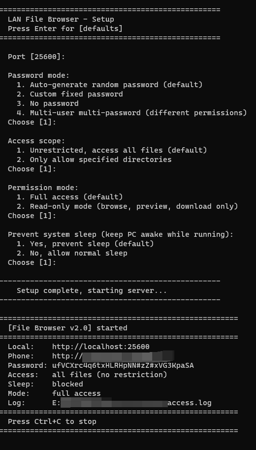

[中文](BEGINNER.md) | **English**

# Step-by-Step Beginner Tutorial

> This tutorial is for users with no programming experience — we'll guide you through everything from scratch.
>
> Back to [README](../README_EN.md)

> **Shortcut**: Don't want to install Python? Download from [Releases](https://github.com/bbyybb/lan-file-browser/releases) and skip Steps 1-3 below.
> - **Windows**: Download `FileBrowser.exe`, double-click to run
> - **macOS**: Download `lan-file-browser-macOS-*`, double-click to run (Terminal opens automatically)
>>   If macOS says "cannot be verified", go to **System Settings > Privacy & Security** and click **Open Anyway**
> - **Linux**: Download `lan-file-browser-Linux`, double-click or run `cd ~/Downloads && ./lan-file-browser*` in Terminal

---

## Step 1: Install Python (One Time Only)

Python is the runtime environment for this program, similar to how you need Office installed to run Word.

### Windows Users

1. Open your browser and visit the Python download page:
   https://www.python.org/downloads/

2. Click the yellow **"Download Python 3.x.x"** button to download the installer

3. Double-click the downloaded installer (e.g., `python-3.x.x-amd64.exe`)

4. **The most critical step**: At the bottom of the installation screen, **make sure to check "Add Python to PATH"**
   ```
   ☑ Add Python 3.x to PATH    ← Must check this!!!
   ```
   > If you forget to check this, later commands will say "python not found"

5. Click **"Install Now"** to begin installation

6. Wait for installation to complete, click **"Close"**

### macOS Users

1. Open the **"Terminal"** app (in Launchpad → Other → Terminal, or Spotlight search "Terminal")

2. Type the following command to check if Python is already installed:
   ```
   python3 --version
   ```

3. If it shows `Python 3.x.x`, it's already installed — skip to Step 2

4. If it says not found, visit https://www.python.org/downloads/ to download and install the macOS version

### Verify Python Installation

After installation, open a terminal (see "How to Open Terminal" below) and type:

```
python --version
```

Seeing output like `Python 3.11.5` means installation was successful.

> macOS/Linux users: use `python3 --version`

---

## How to Open Terminal (Command Line)

The terminal is a window where you can type commands. Don't be intimidated — you just need to copy and paste commands.

### Windows

Three methods (choose any one):

**Method A (Easiest):**
1. Press the `Win` key (the Windows logo key) on your keyboard
2. Type `cmd`
3. Click the **"Command Prompt"** that appears

**Method B:**
1. Open File Explorer and navigate to the folder containing `file_browser.py`
2. Type `cmd` in the address bar and press Enter

**Method C:**
1. Right-click on empty space on the desktop or in a folder
2. Select **"Open in Terminal"** (Windows 11) or **"Open command window here"** (Windows 10)

### macOS

1. Press `Command + Space` to open Spotlight
2. Type `Terminal`
3. Press Enter to open

---

## Step 2: Download This Program

1. Go to https://github.com/bbyybb/lan-file-browser
2. Click the green **"Code"** button
3. Click **"Download ZIP"**
4. Extract the downloaded ZIP file to any location (e.g., Desktop)

> Please download the complete ZIP package — don't download individual files, or the program won't work properly.

---

## Step 3: Install Dependencies (One Time Only)

Open the terminal and type the following command:

```
pip install flask
```

> macOS/Linux users: use `pip3 install flask`

Seeing output like `Successfully installed flask-x.x.x` means installation was successful.

**Common issues:**
- If you see `'pip' is not recognized as an internal or external command`, it means Python wasn't added to PATH during installation. Reinstall Python and **make sure to check "Add to PATH"**
- If the download is slow, try upgrading pip first: `python -m pip install --upgrade pip`, then retry

---

## Step 4: Start the Program

### 4.1 Navigate to the Program Directory

Assuming you extracted the program to a `lan-file-browser` folder on your Desktop:

**Windows:**
```
cd Desktop\lan-file-browser
```

**macOS:**
```
cd ~/Desktop/lan-file-browser
```

> Or use the "Open terminal in folder" method mentioned above, so you don't need to `cd`

### 4.2 Run the Program

```
python file_browser.py
```

> macOS/Linux users: use `python3 file_browser.py`

### 4.3 Follow the Prompts

The program will show an interactive wizard — **just press Enter at each prompt** (to use defaults):

```
==================================================
  LAN File Browser - Startup Configuration
  Press Enter to use [default values]
==================================================

  Port [25600]:                          ← Just press Enter
  Password mode:
    1. Auto-generate random password (default)
    2. Custom fixed password
    3. No password
    4. Multi-user multi-password (different users, different permissions)
  Choose [1]:                            ← Just press Enter
  ...
```

> **Recommended for teachers:** If sharing courseware in a classroom, choose password mode `4` (multi-user), then choose `1` (auto-generate). The system will auto-generate an admin password and a read-only password.

### 4.4 Successful Startup

Seeing the following screen means the server started successfully:

<!-- Terminal startup screenshot -->


```
======================================================
  [File Browser v2.6.1] started
======================================================
  Local:    http://localhost:25600
  Phone:    http://192.168.1.100:25600    ← The address to open on your phone
  Password: CvW$MwG*kuV5Yy*b12ZHohEX     ← Login password
======================================================
  Press Ctrl+C to stop
======================================================
```

**Remember two key pieces of information:**
- The address after `Phone` → open this in your phone's browser (or share with others)
- The password after `Password` → enter this when logging in

---

## Step 5: Using on Your Phone

### 5.1 Connect to the Same WiFi

Make sure your phone and computer are connected to the **same WiFi** (same router).

> For example: both home computer and phone on home WiFi; in a classroom, both on school WiFi

### 5.2 Open Browser

On your phone, open any browser (Safari, Chrome, etc.) and type the `Phone` address shown in the terminal, for example:

```
http://192.168.1.100:25600
```

> Note: it's `http://` not `https://`, and include the full address with port number

### 5.3 Scan QR Code (Easier)

If typing the address is too much trouble, scan the QR code displayed on the login page (it shows automatically in the center of the page).

### 5.4 Enter Password

On the login page, enter the password shown in the terminal and click "Login".

### 5.5 Start Using

After logging in, you can see all your computer files:
- **Click a folder** → enter and browse
- **Click a file** → preview (images, videos, PDF, Word, Excel, etc.)
- **Click the ⬇ button** → download file to phone
- **Top search box** → search for files

---

## Step 6: Stop the Program

When done, press `Ctrl + C` in the terminal window (hold Ctrl and press C simultaneously). The program will show:

```
  Server stopped.
```

Then close the terminal window.

---

## Common Scenario Examples

### Scenario 1: Share Only a Specific Folder (Read-Only)

Share only a specific folder where others can view and download but not modify:

```
python file_browser.py --roots D:/shared-files --read-only --no-password
```

> macOS example: `python3 file_browser.py --roots /Users/yourusername/shared-files --read-only --no-password`

Effect:
- Only the "shared-files" folder content is visible
- Browse and download only, no modifications allowed
- No password needed, scan QR code and use immediately

### Scenario 2: Different Passwords with Different Permissions

During startup, choose password mode `4` (multi-user) → choose `1` (auto-generate). The system will show two passwords:

```
  Users:    2 user(s):
            - admin  (Admin):   xKj9Tm2P...    ← Your password (full access)
            - reader (ReadOnly): Qs7nWj4R...    ← Password for others (read-only)
```

- You log in with the `admin` password → can upload, edit, delete
- Others log in with the `reader` password → can only browse and download

### Scenario 3: Generate a Temporary Download Link for a Friend

1. Open a file preview
2. Click the **"🔗 Share"** button at the top
3. Copy the generated link and send to your friend
4. Your friend clicks the link to download directly — no login needed (link expiration is configurable: 5 minutes / 30 minutes / 1 hour / 6 hours / 12 hours / 24 hours, default 1 hour; the link auto-expires after the chosen period)

---

## FAQ

### Phone can't open the address?

1. Confirm phone and computer are on the same WiFi
2. Confirm you're using the `Phone` line address, not the `Local` line
3. Confirm the full address is entered, including the `:25600` port number
4. Windows may need to allow firewall access (system will prompt on first run — click "Allow")

### Getting "'python' is not recognized as an internal or external command"?

Python is not properly installed or not added to PATH. Reinstall Python and **make sure to check "Add Python to PATH"**.

### pip install is slow?

Try upgrading pip first: `python -m pip install --upgrade pip`, then retry. If you're in China, you can use a mirror: `pip install flask -i https://pypi.tuna.tsinghua.edu.cn/simple`

### Service stops after closing the terminal?

Yes, the terminal window is the program's "switch". Keep the terminal window open for the service to run.

### Do I need to install again next time?

No. Python and Flask only need to be installed once. After that, just run `python file_browser.py` directly.

---

## Next Steps

Congratulations, you've learned the basics! To explore advanced features (regex search, Office preview, public access, etc.), check out the [Detailed Feature Guide](GUIDE_EN.md).
