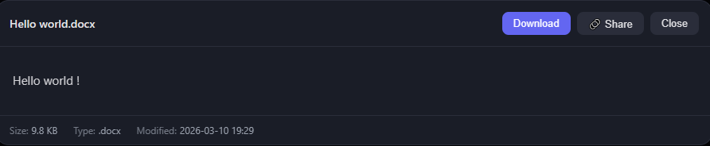
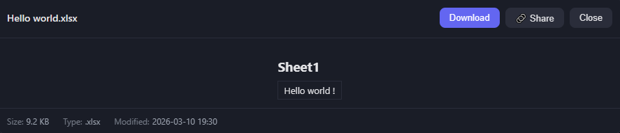

[中文](GUIDE.md) | **English**

# Detailed Feature Guide

> Back to [README](../README_EN.md) | Complete beginner? See the [Step-by-Step Beginner Tutorial](BEGINNER_EN.md)

---

## Table of Contents

- [Interactive Setup Wizard](#interactive-setup-wizard)
- [Directory Whitelist (Sandbox Mode)](#directory-whitelist-sandbox-mode)
- [Read-Only Mode](#read-only-mode)
- [Multi-User Multi-Password](#multi-user-multi-password)
- [Password Protection & Login](#password-protection--login)
- [QR Code Quick Connect](#qr-code-quick-connect)
- [Browse Files](#browse-files)
- [Filename Search](#filename-search)
- [File Content Search](#file-content-search)
- [Regex Search](#regex-search)
- [Preview Files](#preview-files)
- [Office Online Preview](#office-online-preview)
- [Video Subtitles](#video-subtitles)
- [ZIP Preview & Extraction](#zip-preview--extraction)
- [Online File Editing](#online-file-editing)
- [Download Files](#download-files)
- [Folder Download](#folder-download)
- [Upload Files & Drag-and-Drop](#upload-files--drag-and-drop)
- [File Copy](#file-copy)
- [File Move](#file-move)
- [Create Folder / File](#create-folder--file)
- [Rename](#rename)
- [Delete Files](#delete-files)
- [Temporary Share Links](#temporary-share-links)
- [Shared Clipboard](#shared-clipboard)
- [Directory Bookmarks](#directory-bookmarks)
- [Sort & Filter](#sort--filter)
- [Light / Dark Theme](#light--dark-theme)
- [Grid / List View](#grid--list-view)
- [Language Toggle](#language-toggle)
- [Logout](#logout)
- [Prevent System Sleep](#prevent-system-sleep)
- [HTTPS Configuration](#https-configuration)
- [Public Access (Tunneling)](#public-access-tunneling)
- [Access Log](#access-log)
- [Supported File Types](#supported-file-types)
- [Technical Architecture](#technical-architecture)

---

## Interactive Setup Wizard

When running `python file_browser.py` without any arguments, the program enters an interactive wizard that guides you through startup configuration step by step. Press Enter at any prompt to use the default value shown in brackets.

```
==================================================
  LAN File Browser - Startup Configuration
  Press Enter to use [default values]
==================================================

  Port [25600]:                        ← Press Enter for 25600, or type another port

  Password mode:
    1. Auto-generate random password (default)
    2. Custom fixed password
    3. No password
    4. Multi-user with separate passwords
  Choose [1]:                          ← Enter a number to choose, Enter for default

  Access scope:
    1. Unrestricted, access all files (default)
    2. Only allow access to specified directories
  Choose [1]:                          ← Choose 2 to enter directory paths (comma-separated)

  Prevent system sleep (keep computer awake while running):
    1. Yes, prevent sleep (default)
    2. No, allow normal sleep
  Choose [1]:
```

**Three ways to skip the wizard:**

| Method | Command | Description |
|--------|---------|-------------|
| Use all defaults | `python file_browser.py -y` | Skip all prompts, start immediately |
| Specify parameters | `python file_browser.py --roots D:/shared` | Arguments auto-skip wizard |
| Combined | `python file_browser.py --port 8080 --password abc -y` | Specify params + force skip |

---

## Directory Whitelist (Sandbox Mode)

By default, the program allows access to all files on the computer. To restrict the accessible scope, there are two methods:

**Method 1: Command-line arguments (recommended, temporary)**

```bash
python file_browser.py --roots D:/shared-files E:/projects

# macOS example
python3 file_browser.py --roots /Users/bob/Public /tmp/shared
```

**Method 2: Modify configuration file (persistent)**

Edit the top of `file_browser.py`:

```python
ALLOWED_ROOTS = ["D:/shared-files", "E:/projects"]
```

**Method 3: config.json configuration file**

Create a `config.json` file in the same directory as the program to centrally manage all settings:

```json
{
  "port": 8080,
  "password": "mypass",
  "roots": ["D:/shared"],
  "read_only": false,
  "prevent_sleep": true,
  "lang": "zh",
  "ssl_cert": "/path/to/cert.pem",
  "ssl_key": "/path/to/key.pem"
}
```

> Priority: `config.json` < command-line arguments. Command-line arguments override the corresponding settings in `config.json`.

Effects after configuration:
- Home page only shows whitelisted directories (replaces the original drive list)
- All APIs are automatically restricted: browsing, searching, downloading, uploading, copying, moving, etc. can only operate within whitelisted directories
- Paths outside the whitelist are denied (returns 404)
- Attempts to bypass via symlinks are also blocked (uses `os.path.realpath` to resolve real paths)

After startup, the terminal shows:
```
  Access:   2 allowed dir(s):
            - D:/shared-files
            - E:/projects
```

Without `--roots` and with `ALLOWED_ROOTS = []`, there are no restrictions (default behavior).

---

## Read-Only Mode

When enabled, all users can only browse, preview, and download files — no modification operations are allowed. Ideal for teachers sharing courseware, company document sharing, etc.

**Disabled operations:** Upload, create file/folder, edit, delete, rename, copy, move, extract

**Retained operations:** Browse directories, file preview, single file download, batch download, folder download, search, bookmarks, clipboard read, share links

**How to enable:**

Method 1: Interactive wizard
```
  Permission mode:
    1. Full access (default)
    2. Read-only mode
  Choose [1]: 2
```

Method 2: Command-line argument
```bash
python file_browser.py --read-only
```

Method 3: Modify configuration file
```python
READ_ONLY = True
```

**Typical teacher scenario:**
```bash
# Share only courseware directory, read-only mode, no password (classroom LAN)
python file_browser.py --roots D:/courseware --read-only --no-password
```

After startup, the terminal shows `Mode: READ-ONLY`, and write operation buttons are auto-hidden on the page.

---

## Multi-User Multi-Password

When different users need different permissions (e.g., teacher admin + student read-only), configure multi-user mode.

Edit the top of `file_browser.py`:

```python
USERS = {
    "teacher": {"password": "teacher123", "role": "admin"},
    "student": {"password": "stu456",     "role": "readonly"},
}
```

**Role descriptions:**

| Role | Permissions |
|------|-------------|
| `admin` | Full access (browse, preview, download, upload, edit, delete, copy, move, etc.) |
| `readonly` | Read-only (browse, preview, download, search; all modification operations disabled) |

**Behavior:**
- Configuring `USERS` automatically enables multi-user mode; the `PASSWORD` setting is ignored
- On the login page, enter the corresponding user's password — no username needed (system auto-matches)
- After read-only users log in, write operation buttons are auto-hidden
- Terminal banner displays normally without exposing user passwords

**Typical teacher scenario:**
```python
# Teacher logs in with teacher123 for full file management
# Students log in with stu456 for view and download only
USERS = {
    "teacher": {"password": "teacher123", "role": "admin"},
    "student": {"password": "stu456",     "role": "readonly"},
}
ALLOWED_ROOTS = ["D:/courseware"]  # Only expose courseware directory
```

> Note: Multi-user mode and single-password mode (`PASSWORD`) are mutually exclusive. When `USERS` is configured, `PASSWORD` has no effect.

---

## Password Protection & Login

A 32-character strong random password is auto-generated on startup and displayed in the terminal. Users authenticate via cookie after entering the password in the browser. Closing the browser requires re-login.

Three password modes (modify the `PASSWORD` variable at the top of `file_browser.py`):

| Value | Behavior |
|-------|----------|
| `PASSWORD = None` | **Default**. Randomly generated each startup |
| `PASSWORD = "my123"` | Fixed password |
| `PASSWORD = ""` | Disable password protection |

---

## QR Code Quick Connect

The login page auto-displays a QR code of the current access URL. Scan with your phone to open directly — no need to manually type the IP.

---

## Browse Files

- **Home page**: Shows all drives (Windows: C:\, D:\; macOS: /)
- **Navigate**: Click folders to enter
- **Breadcrumb navigation**: Top path bar, click any level to jump (e.g., 🏠 Root > C: > Users > Documents)

---

## Filename Search

1. Type keywords in the top search box, auto-searches after 500ms
2. Case-insensitive, supports partial matching
3. Scope: current directory, recursive 6 levels deep, max 100 results
4. Click ✕ to clear search

**Tip**: Navigate to the target directory first, then search for smaller scope and faster results.

---

## File Content Search

1. After entering keywords, **"Filename Search"** / **"Content Search"** toggle buttons appear below the search box
2. Click **"Content Search"** to search text inside files
3. Results display: filename + matching line number + line content

Limits: Only searches text/code/Markdown files, max 512KB per file, max 500 files scanned.

---

## Regex Search

There's a **`.*`** button to the right of the search box. Click to enable regex mode (highlighted when active).

Supports standard regex syntax, for example:
- `\.py$` — Match filenames ending with .py
- `TODO|FIXME` — Match TODO or FIXME
- `\d{4}-\d{2}-\d{2}` — Match date format

Both filename search and content search support regex mode.

---

## Preview Files

Click a file to open the preview modal:

| Type | Supported Formats |
|------|-------------------|
| Images | jpg, png, gif, webp, svg, bmp, ico |
| Video | mp4, webm (auto-loads same-name subtitles, other formats depend on browser) |
| Audio | mp3, wav, ogg, flac, aac |
| PDF | In-browser reader (mobile: "Open in Browser" button) |
| Markdown | GFM rendering + Mermaid diagrams + in-document link navigation + back navigation |
| **Office** | docx rendered as HTML, xlsx/xls rendered as tables |
| Code/Text | 40+ languages (py, js, ts, go, java, c, cpp, etc.) |
| ZIP | View content list + online extraction (see below) |

Modal actions: Download / Share / Edit / ESC to close.

---

## Office Online Preview

Click an Office file to open the preview modal:

<!-- Office preview screenshots -->
<p align="center">
  
  
</p>

| Format | Preview Method | Technology |
|--------|----------------|------------|
| `.docx` | Rendered as formatted HTML document | mammoth.js (bundled) |
| `.xlsx` `.xls` | Rendered as HTML tables, multiple sheets displayed | SheetJS (bundled) |
| `.pptx` etc. | Preview not yet supported, download button provided | - |

> All frontend libraries are bundled with the program. Office preview works offline without internet access.

---

## Video Subtitles

When playing video, the program auto-detects subtitle files with the same name in the same directory:

- Supported formats: `.vtt`, `.srt`, `.ass`
- Example: Playing `movie.mp4` auto-searches for `movie.vtt`, `movie.srt`, `movie.ass`
- If found, auto-loaded with the first subtitle enabled by default
- If multiple subtitle formats exist, you can switch in the player

> `.vtt` format has the best compatibility — recommended for use.

---

## ZIP Preview & Extraction

Click a `.zip` file to open the preview modal, where you can:
- View the complete file list and sizes inside the ZIP
- Click **"Extract Here"** to extract contents to the ZIP's directory

> Other archive formats (.rar, .7z, etc.) don't support preview — download and extract locally.

---

## Online File Editing

1. Click a text/code/Markdown file to open preview
2. Click **"✏ Edit"** to enter edit mode
3. After modifying, click **"💾 Save"** or press **Ctrl+S** (macOS: Cmd+S)
4. Each save auto-creates a `.bak` backup file

Supports Tab indentation, modification status indicator, and unsaved changes close warning.

---

## Download Files

| Method | Operation |
|--------|-----------|
| Single file | Click ⬇ button in list, or click "Download" in preview modal |
| Batch download | Toolbar → "☐ Multi-select" → check files (or click "☑ All" to select all) → "📦 Batch Download" |
| Batch delete | In multi-select mode → "🗑 Batch Delete" → confirmation dialog |
| Batch move | In multi-select mode → "✂ Batch Move" → select target directory |
| Batch copy | In multi-select mode → "📋 Batch Copy" → select target directory |

---

## Folder Download

Click the **⬇** button next to a folder, and the entire folder is recursively packaged as a `.zip` for download.

- Preserves internal directory structure

---

## Upload Files & Drag-and-Drop

**Method 1: Button upload**
1. Navigate to target directory → click toolbar **"⬆ Upload"**
2. Select files (supports multiple) → upload begins

**Method 2: Drag and drop**
Drag files from your desktop or file manager **directly onto the browser page** and release to upload.

- A **real-time progress bar** is displayed during upload (percentage + uploaded/total size); drag-and-drop uploads show a floating progress bar at the bottom
- No file size limit
- Same-name files auto-get numeric suffix, won't overwrite

---

## File Copy

1. Click the **📋** button next to a file/folder
2. A **visual directory picker** appears, showing subfolders of the current directory
3. Click folders to enter, click `⬆ ..` to go up, click the top input box to manually type a path
4. Click **"Confirm Current Directory"** at the target directory

Duplicates auto-get `_copy1`, `_copy2` suffix.

---

## File Move

1. Click the **✂** button next to a file/folder
2. A **visual directory picker** appears (same UI as copy)
3. Browse to the target directory and click confirm

Shows a conflict warning if same-name file exists at target. Cannot move a folder into itself or its subdirectories.

---

## Create Folder / File

- **Folder**: Toolbar → "📁+ Folder" → enter name
- **File**: Toolbar → "📄+ File" → enter filename (e.g., `notes.md`), optionally fill in initial content

Filenames cannot contain `\ / : * ? " < > |` and other special characters.

---

## Rename

Click the **✏** button next to a file/folder → enter new name → press Enter to confirm.

---

## Delete Files

Click the **🗑** button → confirmation dialog → delete.

- **Files**: Deleted directly
- **Empty folders**: Deleted directly
- **Non-empty folders**: Secondary confirmation (red warning), then recursive deletion of all contents

> Deletion bypasses the recycle bin — permanently deleted. Please use with caution. System critical directories (e.g., `C:\Windows`, `/usr`) are protected and cannot be deleted.

---

## Temporary Share Links

1. While previewing any file, click the **"🔗 Share"** button at the top of the modal
2. Select the link expiration from the dropdown (5 minutes / 30 minutes / 1 hour / 6 hours / 12 hours / 24 hours)
3. Click "Create Share Link"
4. Click "Copy Link" to send to others
5. Recipients can download directly by opening the link — **no login required**

> Links auto-expire after the set time, returning 410 Gone.

---

## Shared Clipboard

Click **"📋 Clipboard"** in the toolbar → enter text → save. Open clipboard on another device to read.

Use case: Transfer URLs, passwords, code snippets, and other text between phone and computer.

> In multi-user mode, clipboard data is isolated per user — each user can only read and write their own clipboard content.

---

## Directory Bookmarks

- **Add**: Enter a directory, click toolbar **"+⭐"**
- **View**: Click **"⭐ Bookmarks"** → click directory name to jump
- **Remove**: Click ✕ in the bookmark list

Bookmark data is persistently saved in `bookmarks.json`, survives restarts.

> In multi-user mode, bookmarks are stored independently per user — different users' bookmarks do not interfere with each other.

---

## Sort & Filter

### Sort

| Button | Default Direction | Description |
|--------|-------------------|-------------|
| Name | A→Z | Alphabetical order |
| Size | Small→Large | File size |
| Created | Old→New | By creation time |
| Modified | New→Old | By modification time |

Click an active button to toggle ascending/descending. Folders always appear first.

### Filter by Type

Dropdown to select: Images / Videos / Audio / Markdown / Text & Code / PDF / Archives / Office / Fonts / Other.

### Filter by Extension

Type extensions in the input box, e.g., `.py,.js,.ts` (comma-separated), press Enter to apply. Both filters can be combined.

---

## Light / Dark Theme

Click the **☀ / 🌙** button in the toolbar to toggle. Preference is auto-saved to the browser and restored on next visit.

---

## Grid / List View

Click the **✦** button in the toolbar to toggle:
- **List view**: Traditional file list (default)
- **Grid view**: Card layout, image files auto-display thumbnails

Preference is auto-saved.

---

## Language Toggle

Click the **中 / EN** button in the toolbar to switch interface language. Preference is auto-saved.

---

## Logout

When password protection is enabled, a **"🚪 Logout"** button appears in the top-right corner of the page. Click to log out and return to the login page.

- Logout clears the authentication cookie in the browser
- In multi-user mode, logout also clears the server-side session record

---

## Prevent System Sleep

While the service is running, the program prevents the computer from entering sleep/hibernate by default, ensuring phones and other devices can access continuously.

**Cross-platform implementation:**

| Platform | Technical Approach | Description |
|----------|--------------------|-------------|
| Windows | `SetThreadExecutionState` API | Notifies system that a program needs to keep running |
| macOS | `caffeinate -i -w <pid>` | Built-in system command, prevents idle sleep |
| Linux | `systemd-inhibit --what=idle` | systemd inhibit lock mechanism |

**Behavior:**
- After startup, terminal shows `Sleep: blocked` to indicate it's active
- On program exit (Ctrl+C or closing terminal), normal system sleep behavior is auto-restored
- Does not affect manual lid-close sleep or clicking the "Sleep" button

**To disable this feature:**
- Command line: `python file_browser.py --no-sleep`
- Or modify file: `PREVENT_SLEEP = False`

---

## HTTPS Configuration

Enable HTTPS encrypted access by providing SSL certificate and private key files.

**Method 1: Command-line arguments**

```bash
python file_browser.py --ssl-cert /path/to/cert.pem --ssl-key /path/to/key.pem
```

**Method 2: config.json configuration file**

```json
{
  "ssl_cert": "/path/to/cert.pem",
  "ssl_key": "/path/to/key.pem"
}
```

Once enabled, the service will be accessible via `https://`, and the terminal will display the HTTPS address.

> Self-signed certificates will cause browser security warnings. You can obtain free trusted certificates from services like Let's Encrypt.

---

## Public Access (Tunneling)

By default, the service is only accessible within the LAN. If you need access from the internet (e.g., accessing your dorm PC from outside), you can use the following tunneling tools.

> **Security reminder**: Public access means anyone could potentially try to connect to your service. Make sure to:
> - Keep password protection enabled (don't set `PASSWORD = ""`)
> - Configure `ALLOWED_ROOTS` whitelist to restrict accessible directories
> - Shut down the tunneling service immediately after use

### Option 1: Cloudflare Tunnel (Recommended)

Free, built-in HTTPS, no registration required, fast.

**Step 1: Install cloudflared**

- Windows: Download from https://developers.cloudflare.com/cloudflare-one/connections/connect-networks/downloads/ and add to PATH
- macOS: `brew install cloudflared`
- Linux: `sudo apt install cloudflared` or download from the official website

**Step 2: Start File Browser**

```bash
python file_browser.py
```

**Step 3: Open another terminal and create the tunnel**

```bash
cloudflared tunnel --url http://localhost:25600
```

The terminal will output a public URL, like:

```
+----------------------------+
|  https://xxx-yyy.trycloudflare.com  |
+----------------------------+
```

Send this URL to yourself and open it in any browser from anywhere — HTTPS encryption included.

**To stop**: Press `Ctrl+C` in the tunnel terminal to stop public access. File Browser itself is unaffected.

### Option 2: ngrok

The most popular tunneling tool, free tier has bandwidth limits.

**Step 1: Register and install**

1. Visit https://ngrok.com/ and register a free account
2. Download ngrok and configure authtoken per the official guide

**Step 2: Start the tunnel**

```bash
ngrok http 25600
```

The terminal shows a public URL (e.g., `https://xxxx.ngrok-free.app`), copy and use.

### Option 3: SSH Tunnel (Zero Installation)

Uses the system's built-in SSH to connect to a free relay service — no extra tools needed.

```bash
ssh -R 80:localhost:25600 nokey@localhost.run
```

The terminal will output a `https://xxxx.localhost.run` URL.

> Stability is moderate, suitable for temporary use. Windows 10 and above includes a built-in SSH client.

### Comparison

| Option | Installation | Registration | HTTPS | Free | Stability | Speed |
|--------|-------------|-------------|-------|------|-----------|-------|
| **Cloudflare Tunnel** | Need cloudflared | Not required | Built-in | Completely free | High | Fast |
| **ngrok** | Need ngrok | Required | Built-in | With limits | High | Fast |
| **SSH Tunnel** | Not needed | Not required | Built-in | Completely free | Moderate | Moderate |

---

## Access Log

All operations are auto-logged to `access.log` and simultaneously printed to the terminal. Log files are auto-rotated: max 10MB per file, keeping the 5 most recent backups (`access.log.1` ~ `access.log.5`):

```
2026-03-05 14:30:00 | 192.168.1.50 | LOGIN | success
2026-03-05 14:31:00 | 192.168.1.50 | DOWNLOAD | C:\Users\report.pdf
2026-03-05 14:32:00 | 192.168.1.50 | UPLOAD | C:\Users\photo.jpg
2026-03-05 14:33:00 | 192.168.1.50 | COPY | C:\a.txt -> C:\backup\a.txt
2026-03-05 14:34:00 | 192.168.1.50 | SHARE_CREATE | C:\Users\doc.pdf
```

Logged operation types: LOGIN, BROWSE, PREVIEW, RAW, SEARCH, CONTENT_SEARCH, DOWNLOAD, DOWNLOAD_FOLDER, BATCH_DOWNLOAD, UPLOAD, MKDIR, MKFILE, DELETE, DELETE_RECURSIVE, RENAME, EDIT, COPY, MOVE, EXTRACT, SHARE_CREATE, SHARE_DOWNLOAD, CLIPBOARD, BOOKMARK_ADD, BOOKMARK_DEL, FOLDER_SIZE, ZIP_LIST.

---

## Supported File Types

### Online Preview

| Type | Extensions |
|------|------------|
| Images | `.jpg` `.jpeg` `.png` `.gif` `.bmp` `.webp` `.svg` `.ico` `.tiff` `.tif` |
| Video | `.mp4` `.webm` `.mkv` `.avi` `.mov` `.flv` `.wmv` `.m4v` `.3gp` |
| Audio | `.mp3` `.wav` `.ogg` `.flac` `.aac` `.wma` `.m4a` `.opus` |
| Markdown | `.md` `.markdown` `.mdown` `.mkd` |
| PDF | `.pdf` |
| Office | `.docx` (rendered as HTML) `.xlsx` `.xls` (rendered as tables) |
| Archives | `.zip` (view content list + extraction) |
| Text/Code | `.txt` `.log` `.csv` `.tsv` `.nfo` `.text` `.py` `.pyw` `.pyi` `.js` `.mjs` `.cjs` `.ts` `.mts` `.cts` `.jsx` `.tsx` `.vue` `.svelte` `.astro` `.html` `.htm` `.css` `.scss` `.sass` `.less` `.json` `.jsonc` `.json5` `.xml` `.yaml` `.yml` `.toml` `.ini` `.cfg` `.conf` `.java` `.kt` `.kts` `.scala` `.groovy` `.gradle` `.c` `.h` `.cpp` `.hpp` `.cc` `.cxx` `.cs` `.fs` `.vb` `.go` `.rs` `.swift` `.dart` `.zig` `.nim` `.rb` `.php` `.pl` `.pm` `.lua` `.r` `.jl` `.sql` `.sh` `.bash` `.zsh` `.fish` `.bat` `.cmd` `.ps1` `.psm1` `.hs` `.ml` `.ex` `.exs` `.erl` `.clj` `.cljs` `.lisp` `.el` `.rkt` `.tcl` `.elm` `.purs` `.res` `.scm` `.sml` `.lean` `.raku` `.sol` `.vy` `.f90` `.pas` `.cob` `.ada` `.glsl` `.hlsl` `.wgsl` `.cu` `.ahk` `.nix` `.awk` `.coffee` `.mdx` `.erb` `.j2` `.jsp` `.mustache` `.tf` `.tfvars` `.hcl` `.graphql` `.proto` `.prisma` `.rst` `.adoc` `.tex` `.org` `.rmd` `.typ` `.srt` `.vtt` `.ass` `.lrc` `.m3u` `.m3u8` `.cue` `.ics` `.vcf` `.pem` `.crt` `.key` `.diff` `.patch` `.asm` `.dockerfile` `.spec` `.csproj` `.sln` and 160+ more |

### Download Only

| Type | Extensions |
|------|------------|
| Archives | `.rar` `.7z` `.tar` `.gz` `.bz2` `.xz` `.zst` `.tgz` |
| Office | `.doc` `.ppt` `.pptx` `.odt` `.ods` `.odp` `.rtf` |
| Fonts | `.ttf` `.otf` `.woff` `.woff2` |

---

## Technical Architecture

```
┌──────────────────────────────────────────────────┐
│              Browser (Phone/Computer)             │
│  ┌────────────────────────────────────────────┐  │
│  │  HTML + CSS + JavaScript (SPA)             │  │
│  │  ├── marked.js       Markdown rendering    │  │
│  │  ├── highlight.js    Code syntax highlight  │  │
│  │  ├── mermaid.js      Diagram rendering     │  │
│  │  ├── DOMPurify       XSS sanitization      │  │
│  │  ├── qrcode.js       QR code generation    │  │
│  │  ├── mammoth.js      Word document preview │  │
│  │  └── SheetJS          Excel preview         │  │
│  └─────────────────────┬──────────────────────┘  │
└────────────────────────┼─────────────────────────┘
                         │ HTTP/HTTPS + Cookie Auth
┌────────────────────────┼─────────────────────────┐
│       Python Flask Server (0.0.0.0:25600)         │
│  ┌─────────────────────┴──────────────────────┐  │
│  │  file_browser.py (single file, all logic)  │  │
│  │                                             │  │
│  │  [Auth]    POST /api/login GET /api/check-auth│ │
│  │  [Browse]  /api/list /api/drives /api/info  │  │
│  │  [Search]  /api/search /api/search-content  │  │
│  │  [Preview] /api/file /api/raw /api/zip-list │  │
│  │  [Download]/api/download /api/download-folder│ │
│  │  [Manage]  /api/upload /api/mkdir /api/delete│ │
│  │            /api/rename /api/copy /api/move  │  │
│  │            /api/extract /api/save-file      │  │
│  │  [Share]   /api/share  /share/<token>       │  │
│  │  [Other]   /api/clipboard /api/bookmarks    │  │
│  │            /api/folder-size                 │  │
│  └─────────────────────────────────────────────┘  │
└──────────────────────────────────────────────────┘
```

**Design philosophy**: Single-file deployment, zero-config startup, minimal dependencies, fully cross-platform.

> For detailed API documentation, see [API Documentation](API_EN.md).
